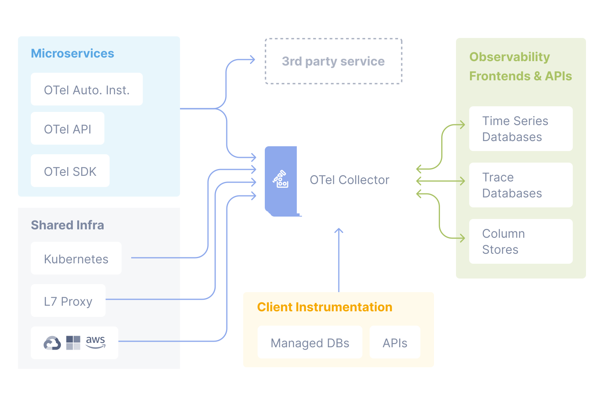

## OpenTelemetry
OpenTelemetry is an Observability framework and toolkit designed to create and manage telemetry data such as traces, metrics, and logs. Crucially, OpenTelemetry is vendor- and tool-agnostic, meaning that it can be used with a broad variety of Observability backends, including open source tools like Jaeger and Prometheus, as well as commercial offerings. OpenTelemetry is a Cloud Native Computing Foundation (CNCF) project.

In order to make a system observable, it must be instrumented. That is, the code must emit traces, metrics, and logs. The instrumented data must then be sent to an Observability backend.
This framework allows developers to instrument their applications with the standard instrumentation library that generates telemetry data from various sources, such as logs, metrics, and traces. OpenTelemetry agents can then collect and export this telemetry data to multiple systems for logging, tracing, and monitoring. The core concept of OpenTelemetry is that it aims to be vendor-agnostic, meaning that the data collected can be sent to different backends and switching between them would require no client-side changes.

OpenTelemetry does two important things:

 - Allows you to own the data that you generate rather than be stuck with a proprietary data format or tool.
 - Allows you to learn a single set of APIs and conventions

### Components of OpenTelemetry

    

#### OTel SDK
The SDK provides libraries for different programming languages that developers use to instrument their applications to collect telemetry data. It also includes the exporter, responsible for transmitting telemetry data to a backend system; in most cases, it is an OpenTelemetry collector.

#### OpenTelemetry Exporter
The exporter transmits telemetry data to a backend system. Exporters are available for backend systems like Jaeger, Zipkin, Prometheus, and more.

#### OpenTelemetry Collector
The collector receives telemetry data from exporters and forwards it to backend systems. It also supports the processing, sampling, and transformation of telemetry data.

#### OpenTelemetry Backend systems
Backend systems store and process telemetry data. Examples include Jaeger, Zipkin, Prometheus, and others.

## API
OpenTelemetry has two main modules - API and SDK. OpenTelemetry API is a set of abstractions and not-operational implementations. Unless your application imports the OpenTelemetry SDK, your instrumentation does nothing and does not impact application performance.

API packages consist of the cross-cutting public interfaces used for instrumentation. Any portion of an OpenTelemetry client which is imported into third-party libraries and application code is considered part of the API.

**Libraries should only use the OpenTelemetry API.**

## SDK
The SDK is the implementation of the API provided by the OpenTelemetry project. Within an application, the SDK is installed and managed by the application owner. Note that the SDK includes additional public interfaces which are not considered part of the API package, as they are not cross-cutting concerns. These public interfaces are defined as constructors and plugin interfaces. Application owners use the SDK constructors; plugin authors use the SDK plugin interfaces. Instrumentation authors MUST NOT directly reference any SDK package of any kind, only the API.

API allows to construct the `Metric` of a chosen type. SDK defines the way to query the current value of a `Metric` to be exported.
Every type of a `Metric` has it’s API to record values to be aggregated. API supports both - push and pull model of setting the `Metric` value.

## Baggage
In OpenTelemetry, Baggage is contextual information that’s passed between spans. It’s a key-value store that resides alongside span context in a trace, making values available to any span created within that trace.

For example, imagine you want to have a CustomerId attribute on every span in your trace, which involves multiple services; however, CustomerId is only available in one specific service. To accomplish your goal, you can use OpenTelemetry Baggage to propagate this value across your system.

## Instrumentation

### Automatic
If applicable a language specific implementation of OpenTelemetry will provide a way to instrument your application without touching your source code. While the underlying mechanism depends on the language, at a minimum this will add the OpenTelemetry API and SDK capabilities to your application. Additionally they may add a set of Instrumentation Libraries and exporter dependencies.

### Manual
You’ll first need to import OpenTelemetry to your service code. If you’re developing a library or some other component that is intended to be consumed by a runnable binary, then you would only take a dependency on the API. If your artifact is a standalone process or service, then you would take a dependency on the API and the SDK. For more information about the OpenTelemetry API and SDK, see the specification.

#### Configure the OpenTelemetry API
In order to create traces or metrics, you’ll need to first create a tracer and/or meter provider. In general, the SDK should provide a single default provider for these objects. You’ll then get a tracer or meter instance from that provider, and give it a name and version. The name you choose here should identify what exactly is being instrumented – if you’re writing a library, for example, then you should name it after your library (for example com.legitimatebusiness.myLibrary) as this name will namespace all spans or metric events produced. It is also recommended that you supply a version string (i.e., semver:1.0.0) that corresponds to the current version of your library or service.

#### Configure the OpenTelemetry SDK
If you’re building a service process, you’ll also need to configure the SDK with appropriate options for exporting your telemetry data to some analysis backend. We recommend that this configuration be handled programmatically through a configuration file or some other mechanism. There are also per-language tuning options you may wish to take advantage of.

#### Create Telemetry Data
Once you’ve configured the API and SDK, you’ll then be free to create traces and metric events through the tracer and meter objects you obtained from the provider. Make use of Instrumentation Libraries for your dependencies.

### Library
A library that enables OpenTelemetry observability for another library is called an Instrumentation Library.

OpenTelemetry provides instrumentation libraries for many libraries, which is typically done through library hooks or monkey-patching library code.

Native library instrumentation with OpenTelemetry provides better observability and developer experience for users, removing the need for libraries to expose and document hooks:

- custom logging hooks can be replaced by common and easy to use OpenTelemetry APIs, users will only interact with OpenTelemetry
- traces, logs, metrics from library and application code are correlated and coherent
- common conventions allow users to get similar and consistent telemetry within same technology and across libraries and languages
- telemetry signals can be fine tuned (filtered, processed, aggregated) for various consumption scenarios using a wide variety of well-documented OpenTelemetry extensibility points.

### Specification
Describes the cross-language requirements and expectations for all implementations. Beyond a definition of terms, the specification defines the following:

- **API**: Defines data types and operations for generating and correlating tracing, metrics, and logging data.
- **SDK**: Defines requirements for a language-specific implementation of the API. Configuration, data processing, and exporting concepts are also defined here.
- **Data**: Defines the OpenTelemetry Protocol (OTLP) and vendor-agnostic semantic conventions that a telemetry backend can provide support for.

## OpenTelemetry vs OpenTracing
OpenTelemetry was formed after the merger of OpenTracing and OpenCensus and is currently being actively developed as the single standard for application instrumentation under CNCF. OpenTelemetry combines the functionalities of OpenTracing and OpenCensus and also extends them.

While OpenTelemetry can be your single source for all kinds of telemetry data like logs, metrics, and traces, OpenTracing was focused only on distributed tracing. For users who are using OpenTracing APIs, they can migrate to OpenTelemetry.

For organizations and developers currently on the fence, the choice is clear: OpenTelemetry. Not only does it encompass the functionalities of OpenTracing, but it also offers extended capabilities. With OpenTracing being deprecated, migrating to OpenTelemetry is the logical step forward. The transition is made easier by OpenTelemetry's active efforts to ensure backward compatibility and its comprehensive approach to telemetry data.

## References

- [OpenTelemetry](https://opentelemetry.io/docs/what-is-opentelemetry/)
- [OpenTelemetry vs OpenTracing](https://signoz.io/blog/opentelemetry-vs-opentracing/)
