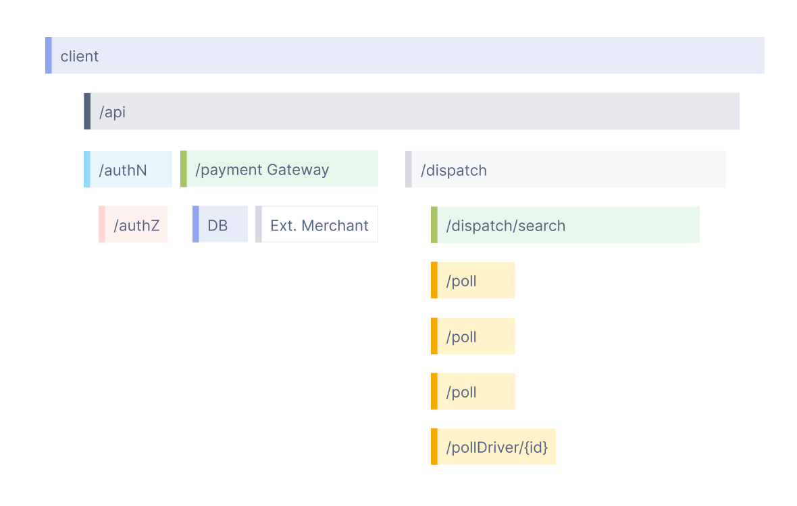

# Observability
Observability lets us understand a system from the outside, by letting us ask questions about that system without knowing its inner workings. Furthermore, it allows us to easily troubleshoot and handle novel problems (i.e. “unknown unknowns”), and helps us answer the question, “Why is this happening?”

In order to be able to ask those questions of a system, the application must be properly instrumented. That is, the application code must emit signals such as traces, metrics, and logs. An application is properly instrumented when developers don’t need to add more instrumentation to troubleshoot an issue, because they have all of the information they need.

OpenTelemetry is an example of mechanism by which application code is instrumented, to help make a system observable.

## Telemetry

**Telemetry** refers to data emitted from a system, about its behavior. The data can come in the form of traces, metrics, and logs.

**Reliability** answers the question: “Is the service doing what users expect it to be doing?” A system could be up 100% of the time, but if, when a user clicks “Add to Cart” to add a black pair of pants to their shopping cart, and instead, the system doesn’t always add black pants, then the system would be said to be unreliable.

**Metrics** are aggregations over a period of time of numeric data about your infrastructure or application. Examples include: system error rate, CPU utilization, request rate for a given service.

## Distributed Tracing

### Logs
A log is a timestamped message emitted by services or other components. Unlike traces, however, they are not necessarily associated with any particular user request or transaction. They are found almost everywhere in software, and have been heavily relied on in the past by both developers and operators alike to help them understand system behavior.

Sample log:

```shell
[2021-02-23T13:26:23.505892 #22473]  INFO -- : [6459ffe1-ea53-4044-aaa3-bf902868f730] Started GET "/" for ::1 at 2021-02-23 13:26:23 -0800
```
Unfortunately, logs aren’t extremely useful for tracking code execution, as they typically lack contextual information, such as where they were called from.
They become far more useful when they are included as part of a span, or when they are correlated with a trace and a span.

## Spans
A span represents a unit of work or operation. It tracks specific operations that a request makes, painting a picture of what happened during the time in which that operation was executed.
A span contains name, time-related data, structured log messages, and other metadata (that is, Attributes) to provide information about the operation it tracks.


## Distributed Traces
A distributed trace, more commonly known as a trace, records the paths taken by requests (made by an application or end-user) as they propagate through multi-service architectures, like microservice and serverless applications.
Without tracing, it is challenging to pinpoint the cause of performance problems in a distributed system.
It improves the visibility of our application or system’s health and lets us debug behavior that is difficult to reproduce locally. Tracing is essential for distributed systems, which commonly have nondeterministic problems or are too complicated to reproduce locally.

<p align="center">
    
</p>

A trace is made of one or more spans. The first span represents the root span. Each root span represents a request from start to finish. The spans underneath the parent provide a more in-depth context of what occurs during a request (or what steps make up a request).
A trace is built from spans. Each span represents an interaction, like an HTTP request, a DB query, a serverless function invocation, etc. A trace is essentially a tree of spans. Based on the collected span data, a distributed tracing platform can capture all the interactions between the different architectural components and tie them together with a trace ID. Then, the various architectural components and the interactions between them can be correlated for different purposes, one of them is visualization in a tree-like manner.

# Instrumentation 

Instrumentation is the process of adding code to your application so you can understand its inner state. Instrumented applications measure what code is doing when it responds to active requests by collecting data such as metrics, events, logs, and traces (MELT). So when you fully instrument, you set up how you want to monitor logs and also define how you'll look at other data that can give you more information about your system.

In contrast to an application that isn’t instrumented and only uses point-in-time logs, an instrumented application tracks as much information as possible about the service’s operations and behavior. It provides more detail about what is happening, so you can see relationships between requests. 

## References

- [Instrumentation](https://newrelic.com/blog/best-practices/logging-vs-instrumentation)
